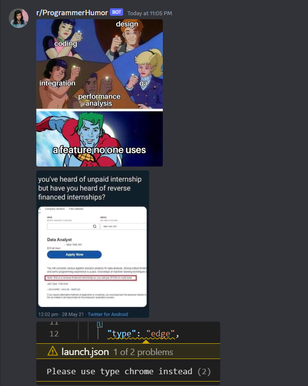

# Meme Man

Fill your Discord channel with programmer memes.

## Demo

## Usage

### Requirements

- Node.js verson 16 or higher
- A tool to run this as a daemon like `pm2`, `docker`, `screen`, etc.

### Creating a webhook in Discord

In progress...

### Setting up the program

In the file `.env.example`, Replace `<YOUR WEBHOOK UR HERE>` with your Discord webhook url. Then rename it to `.env`.

Then install the dependencies with the `yarn` command and run the program as a daemon using the daemon tool of your choice like `pm2`, `docker`, `screen`, etc.

It sends memes every minute.
